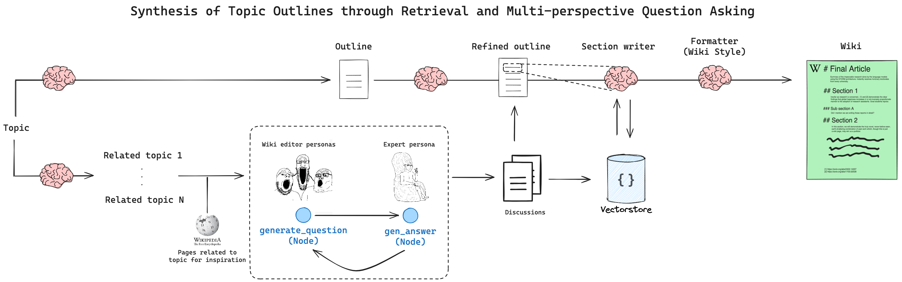

# STORM

This is a very basic reimplemention of the code provided by LangChain here: https://github.com/langchain-ai/langgraph/blob/main/examples/storm/storm.ipynb

### My reimplementation

I removed the strict relation to the wikipedia, generating more generic  content.

I wrote some classes to separated the various sections of the flow.

I added a very basic mechanism to separate the variouse phases and allow to generate only one or the other, saving the work in a Pickle file.

I also added a .md generator that includes almost all information generated during the process.

### Future extension

I'd like to add the possibility to manage some RAG information, so that some of the information can be also collected from local file.

Some of the code is currently very badly organized, for now is more a backup that an actual project.

### Documentation from the LangChain project

[STORM](https://arxiv.org/abs/2402.14207) is a research assistant designed by Shao, et. al that extends the idea of "outline-driven RAG" for richer article generation.

STORM is designed to generate Wikipedia-style ariticles on a user-provided topic. It applies two main insights to produce more organized and comprehensive articles:

Creating an outline (planning) by querying similar topics helps improve coverage.
Multi-perspective, grounded (in search) conversation simulation helps increase the reference count and information density.
The control flow looks like the diagram below.

STORM has a few main stages:

Generate initial outline + Survey related subjects
Identify distinct perspectives
"Interview subject matter experts" (role-playing LLMs)
Refine outline (using references)
Write sections, then write article
The expert interviews stage ocurrs between the role-playing article writer and a research expert. The "expert" is able to query external knowledge and respond to pointed questions, saving cited sources to a vectorstore so that the later refinement stages can synthesize the full article.

There are a couple hyperparameters you can set to restrict the (potentially) infinite research breadth:

N: Number of perspectives to survey / use (Steps 2->3) M: Max number of conversation turns in step (Step 3)
